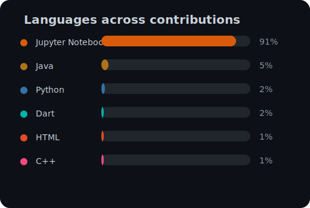

  
  
  
  
  

<!-- START_RECENT_COMMITS -->

  <table style="width:90%;max-width:720px;border-collapse:collapse;font-family:'Segoe UI', Ubuntu, sans-serif;font-size:14px;color:#c9d1d9;">
    <thead>
      <tr style="text-align:left;color:#8b949e;font-size:13px;">
        <th style="padding:6px 8px;">Date</th>
        <th style="padding:6px 8px;">Commit</th>
        <th style="padding:6px 8px;">Repository</th>
      </tr>
    </thead>
    <tbody>
  <tr>
    <td><code>2025-11-23</code></td>
    <td><a href="https://github.com/Giusgarus/skill_up/commit/aa8d69c9b15682713d81f7de180a3d610c464340" target="_blank" rel="noopener noreferrer">Wired frontend follow-up</a></td>
    <td><a href="https://github.com/Giusgarus/skill_up" target="_blank" rel="noopener noreferrer">Giusgarus/skill_up</a></td>
  </tr>
  <tr>
    <td><code>2025-11-23</code></td>
    <td><a href="https://github.com/Giusgarus/skill_up/commit/8f926b6aaee67bbcb481e4cede911b1f715d93a7" target="_blank" rel="noopener noreferrer">Backend fix follow-up + refactoring</a></td>
    <td><a href="https://github.com/Giusgarus/skill_up" target="_blank" rel="noopener noreferrer">Giusgarus/skill_up</a></td>
  </tr>
  <tr>
    <td><code>2025-11-20</code></td>
    <td><a href="https://github.com/Giusgarus/skill_up/commit/fa3fabbdb0da9e85c1a4e3cb21b3fa3fc4a32624" target="_blank" rel="noopener noreferrer">update back</a></td>
    <td><a href="https://github.com/Giusgarus/skill_up" target="_blank" rel="noopener noreferrer">Giusgarus/skill_up</a></td>
  </tr>
    </tbody>
  </table>

<!-- END_RECENT_COMMITS -->

<!-- START_RECENT_PRS -->

  <!-- No recent pull requests available -->

<!-- END_RECENT_PRS -->
